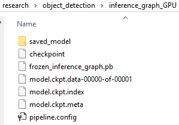

---

<h1 id="notes-on-practicing-object-detection-training-using-tensorflow-gpu">Notes on practicing object detection training using tensorflow-gpu</h1>
<p>This is to document my practice on using tensorflow (GPU) for object detection training following <a href="https://github.com/EdjeElectronics/TensorFlow-Object-Detection-API-Tutorial-Train-Multiple-Objects-Windows-10">https://github.com/EdjeElectronics/TensorFlow-Object-Detection-API-Tutorial-Train-Multiple-Objects-Windows-10</a></p>
<p>About my computer:</p>
<pre class=" language-intel"><code class="prism  language-intel">Nvdia GeForce GTX 1080 (8G)
system type: 64-bit Operation Sysytem, x64-nased processor
Windows 10 
</code></pre>
<p>GTX 1080 related info and installation:</p>
<pre><code>Driver version installed: 385.54
CUDA cores: 2560
Dedicated video memory: 8192 MB GDDR5X
CUDA version: 9.0
cudnn version: 7.3
</code></pre>
<p>The reference summarized 8 steps “How To Train an Object Detection Classifier for Multiple Objects Using TensorFlow (GPU) on Windows 10”</p>
<h3 id="installing-tensorflow-gpu">1. Installing TensorFlow-GPU</h3>
<p>I used conda to install python3 first. An then installed two virtual environments which I named  “tensorflowCPU” and “tensorflow”. The second one has tensorflow-GPU installed.<br>
To find out cuda version installed on my computer, I run<br>
<code>nvcc --version</code><br>
which output:<br>
<code>nvcc: NVIDIA (R) Cuda compiler driver 	Copyright (c) 2005-2017 NVIDIA Corporation 	Built on Fri_Sep__1_21:08:32_Central_Daylight_Time_2017 	Cuda compilation tools, release 9.0, V9.0.176</code><br>
To find out what version of cudnn installed, I run<br>
<code>where cudnn*</code><br>
It gives me:<br>
<code>C:\Program Files\NVIDIA GPU Computing Toolkit\CUDA\v9.0\bin\cudnn64_7.dll</code>	<br>
That tells me the location of cudnn head file:</p>
<pre><code>C:\Program Files\NVIDIA GPU Computing Toolkit\CUDA\v9.0\include\cudnn.h
</code></pre>
<p>By checking file cudnn.h, I can see that cudnn 7.3 is installed on my computer.<br>
To check if python can find the GPU, use these two python commands in the virtual Python:</p>
<pre><code>from tensorflow.python.client import device_lib
print(device_lib.list_local_devices())
</code></pre>
<p>Here is what I run in my virtual env “tensorflow”:</p>
<pre><code>(tensorflow) C:\tensorflow1\models\research\object_detection&gt;python
Python 3.6.7 |Anaconda, Inc.| (default, Oct 28 2018, 19:44:12) [MSC v.1915 64 bit (AMD64)] on win32
Type "help", "copyright", "credits" or "license" for more information.
&gt;&gt;&gt; from tensorflow.python.client import device_lib
&gt;&gt;&gt; print(device_lib.list_local_devices())
2019-06-22 23:55:04.087622: I tensorflow/core/platform/cpu_feature_guard.cc:141] Your CPU supports instructions that this TensorFlow binary was not compiled to use: AVX2
2019-06-22 23:55:04.391790: I tensorflow/core/common_runtime/gpu/gpu_device.cc:1432] Found device 0 with properties:
name: GeForce GTX 1080 major: 6 minor: 1 memoryClockRate(GHz): 1.7335
pciBusID: 0000:01:00.0
totalMemory: 8.00GiB freeMemory: 6.59GiB
2019-06-22 23:55:04.398464: I tensorflow/core/common_runtime/gpu/gpu_device.cc:1511] Adding visible gpu devices: 0
2019-06-22 23:55:07.019463: I tensorflow/core/common_runtime/gpu/gpu_device.cc:982] Device interconnect StreamExecutor with strength 1 edge matrix:
2019-06-22 23:55:07.022864: I tensorflow/core/common_runtime/gpu/gpu_device.cc:988]      0
2019-06-22 23:55:07.024661: I tensorflow/core/common_runtime/gpu/gpu_device.cc:1001] 0:   N
2019-06-22 23:55:07.029817: I tensorflow/core/common_runtime/gpu/gpu_device.cc:1115] Created TensorFlow device (/device:GPU:0 with 6353 MB memory) -&gt; physical GPU (device: 0, name: GeForce GTX 1080, pci bus id: 0000:01:00.0, compute capability: 6.1)
[name: "/device:CPU:0"
device_type: "CPU"
memory_limit: 268435456
locality {
}
incarnation: 2708774219951533837
, name: "/device:GPU:0"
device_type: "GPU"
memory_limit: 6661709496
locality {
  bus_id: 1
  links {
  }
}
incarnation: 16312293861339221583
physical_device_desc: "device: 0, name: GeForce GTX 1080, pci bus id: 0000:01:00.0, compute capability: 6.1"
</code></pre>
<p>If I run on the tensorflowCPU Python environment, it won’t list the GPU device.</p>
<h3 id="setting-up-the-object-detection-directory-structure-and-anaconda-virtual-environment">2. Setting up the Object Detection directory structure and Anaconda Virtual Environment</h3>
<p>In my case, it requires two more Protobuf files (*.proto) to be compiled: </p>
<pre><code>
```
flexible_grid_anchor_generator.proto 
calibration.proto
``` 
So I added them to the end of the cmd as below:
```
protoc --python_out=. .\object_detection\protos\anchor_generator.proto .\object_detection\protos\argmax_matcher.proto .\object_detection\protos\bipartite_matcher.proto .\object_detection\protos\box_coder.proto .\object_detection\protos\box_predictor.proto .\object_detection\protos\eval.proto .\object_detection\protos\faster_rcnn.proto .\object_detection\protos\faster_rcnn_box_coder.proto .\object_detection\protos\grid_anchor_generator.proto .\object_detection\protos\hyperparams.proto .\object_detection\protos\image_resizer.proto .\object_detection\protos\input_reader.proto .\object_detection\protos\losses.proto .\object_detection\protos\matcher.proto .\object_detection\protos\mean_stddev_box_coder.proto .\object_detection\protos\model.proto .\object_detection\protos\optimizer.proto .\object_detection\protos\pipeline.proto .\object_detection\protos\post_processing.proto .\object_detection\protos\preprocessor.proto .\object_detection\protos\region_similarity_calculator.proto .\object_detection\protos\square_box_coder.proto .\object_detection\protos\ssd.proto .\object_detection\protos\ssd_anchor_generator.proto .\object_detection\protos\string_int_label_map.proto .\object_detection\protos\train.proto .\object_detection\protos\keypoint_box_coder.proto .\object_detection\protos\multiscale_anchor_generator.proto .\object_detection\protos\graph_rewriter.proto .\object_detection\protos\flexible_grid_anchor_generator.proto .\object_detection\protos\calibration.proto
```
</code></pre>
<h3 id="gathering-and-labeling-pictures">3. Gathering and labeling pictures</h3>
<p>I didn't make any changes for this practice.<p/>
<h3 id="generating-training-data">4. Generating training data</h3>
<pre><code>I didn't make any changes for this practice..
</code></pre>
<h3 id="creating-a-label-map-and-configuring-training">5. Creating a label map and configuring training</h3>
<p>I created a new folder “training_GPU” (under "object_detection). and then copied two files (from folder “training” into my new folder: faster_rcnn_inception_v2_pets.config and labelmap.pbtxt.</p>
<h3 id="run-the-training">6. Run the Training</h3>
<p>Since I created my own train_dir “training_GPU”, my training cmd line is slightly changed as:</p>
<pre><code>python train.py --logtostderr --train_dir=training_GPU/ --pipeline_config_path=training_GPU/faster_rcnn_inception_v2_pets.config
</code></pre>
<h3 id="export-inference-graph">7. Export Inference Graph</h3>
<p>As I don’t want to overwrite the original  directory “inference_graph”, I create a brand-new folder " inference_graph_GPU". Note that I also have my own training directory. So here is command to export inference graph</p>
<pre><code>python export_inference_graph.py --input_type image_tensor --pipeline_config_path training_GPU/faster_rcnn_inception_v2_pets.config --trained_checkpoint_prefix training_GPU/model.ckpt-200000 --output_directory inference_graph_GPU
</code></pre>
<p>After that, I check my folder " inference_graph_GPU" and it looks like below:</p>
<p align="center">
  
</p>
<h3 id="testing-and-using-your-newly-trained-object-detection-classifier">8. Testing and using your newly trained object detection classifier</h3>

